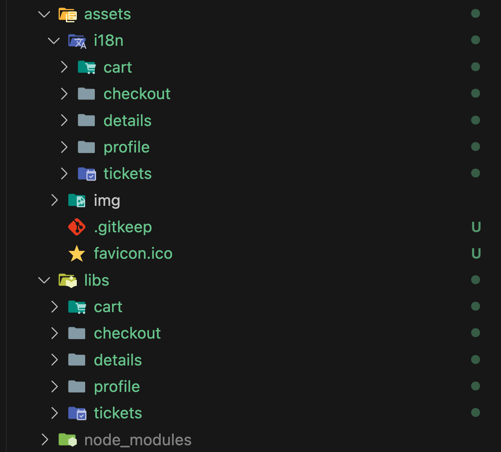
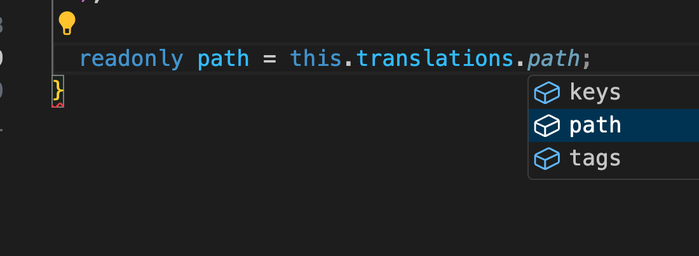
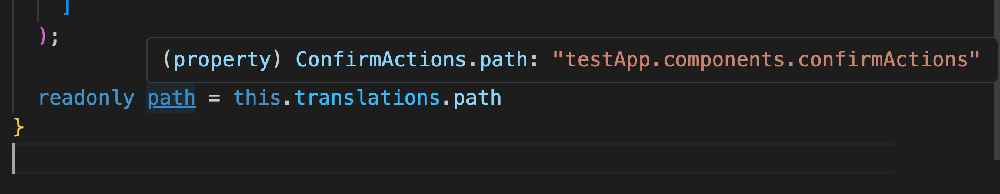
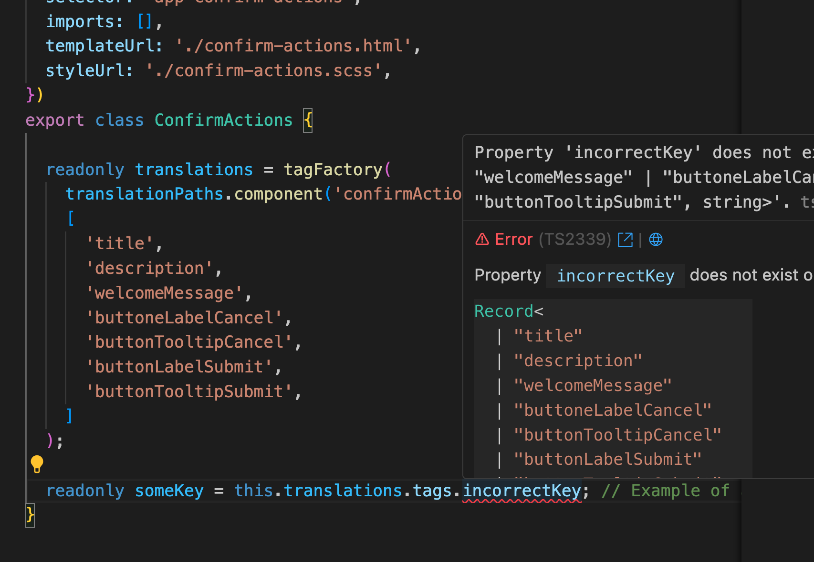
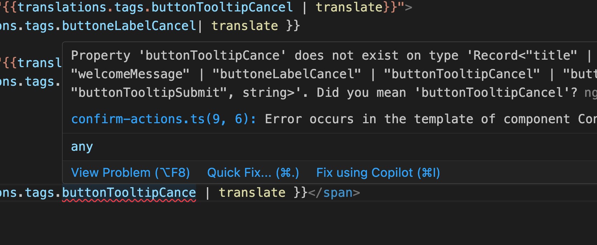
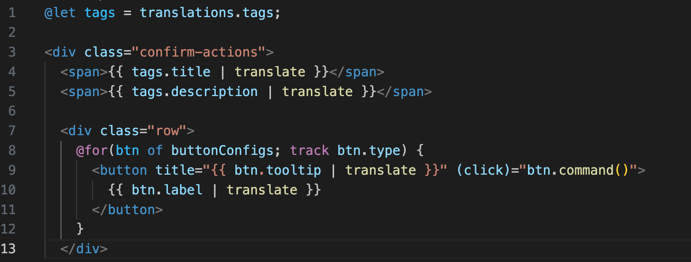

## Usage

This section assumes that you have already installed the NGX Translate Toolkit in your Angular project. If you haven't done so, please refer to the [Installation guide](installation.html).

We also assume that you are using the standalone API for your angular application. If you are still using NgModules, the same principles apply, but you will need to adapt the configuration to your module setup.

### Providing the Loader

In your `app.config.ts`, at the time of providing `TranslateService` you will pass to the `loader` attribute one of the functions exported by the toolkit:

- `provideHttpMultiLoader` It is recommended for most applications, as it uses Angular's `HttpBackend` to load translation files. It requires that you provide `HttpClient` before calling `provideTranslateService`.

- `provideFetchMultiLoader` It is recommended for client side rendered applications, as it uses the Fetch API to load translation files. This option **cannot** be used in server-side rendered applications (SSR) or Angular Universal, as it relies on browser APIs, but it is better if you are not planning to use SSR or Angular's `HttpClient` at all.

#### Example Configuration with provideHttpMultiLoader

```typescript
import { ApplicationConfig, provideBrowserGlobalErrorListeners, provideZoneChangeDetection } from "@angular/core";
import { provideRouter } from "@angular/router";

import { routes } from "./app.routes";
import { provideTranslateService } from "@ngx-translate/core";
import { pathFactory, provideHttpMultiLoader } from "@robmanganelly/ngx-translate-toolkit";
import { provideHttpClient } from "@angular/common/http";

export const translationPaths = pathFactory("testApp");

export const appConfig: ApplicationConfig = {
  providers: [
    provideBrowserGlobalErrorListeners(),
    provideZoneChangeDetection({ eventCoalescing: true }),
    provideHttpClient(),
    provideTranslateService({
      fallbackLang: "en-us",
      loader: provideHttpMultiLoader(),
    }),
    provideRouter(routes),
  ],
};
```

#### Example Configuration with provideFetchMultiLoader

```typescript
import { ApplicationConfig, provideBrowserGlobalErrorListeners, provideZoneChangeDetection } from "@angular/core";
import { provideRouter } from "@angular/router";

import { routes } from "./app.routes";
import { provideTranslateService } from "@ngx-translate/core";
import { pathFactory, provideFetchMultiLoader } from "@robmanganelly/ngx-translate-toolkit";

export const translationPaths = pathFactory("testApp");

export const appConfig: ApplicationConfig = {
  providers: [
    provideBrowserGlobalErrorListeners(),
    provideZoneChangeDetection({ eventCoalescing: true }),
    provideTranslateService({
      fallbackLang: "en-us",
      loader: provideFetchMultiLoader(),
    }),
    provideRouter(routes),
  ],
};
```

> These examples assume that your application's translation files are at `public/i18n/[language].json`. If that is the case, the translation files for the application will be loaded automatically from that path.

#### Loading other translation files

If you need to load translation files from a different location, you can customize the loader configuration. For that purpose, use the `withTranslationSource` function to specify the path for your translation files.
That function accepts a string or an object with a `locator` attribute, which is a string that represents the name of the project where the translation files are located.

Each path must be registered with a unique locator. If you have multiple paths that need to be loaded, use `withTranslationSource` for each one.

> if you pass a TranslationSource object `withTranslationSource` will use the `locator` and build the path using `assets/i18n/{{ locator }}/{{ lang }}.json` as the default path for your translation files. If this is not the desired path, you need to provide a custom path (string) instead. but in that case you must ensure that the path satisfies the `{{ lang }}` placeholder. This placeholder is exported by the toolkit.

```typescript
import { ApplicationConfig, provideBrowserGlobalErrorListeners, provideZoneChangeDetection } from "@angular/core";
import { provideRouter } from "@angular/router";
import { routes } from "./app.routes";
import { provideTranslateService } from "@ngx-translate/core";
import { pathFactory, provideHttpMultiLoader, withTranslationSource, languageSourcePlaceholder } from "@robmanganelly/ngx-translate-toolkit";
import { provideHttpClient } from "@angular/common/http";

export const translationPaths = pathFactory("testApp");

export const appConfig: ApplicationConfig = {
  providers: [
    provideBrowserGlobalErrorListeners(),
    provideZoneChangeDetection({ eventCoalescing: true }),
    provideHttpClient(),
    provideTranslateService({
      fallbackLang: "en-us",
      loader: provideHttpMultiLoader(
        withTranslationSource({ locator: "cart" }),
        withTranslationSource({ locator: "checkout" }),
        withTranslationSource({ locator: "product-details" }),
        // declaring a custom path
        withTranslationSource(`another/path/to/translations/${languageSourcePlaceholder}.json`)
      ),
    }),
    provideRouter(routes),
  ],
};
```

### Creating translation files

#### For Applications

- Locate the path where your assets are served (usually `public/` or `src/assets`)
- Create a directory named `i18n` if it does not exist.
- Inside the `i18n` directory, create JSON files for each language you want to support. Be sure to match the language codes if you're using them (e.g., `en-us.json`, `fr-fr.json`)

#### For libraries or projects with shared components

- For simplicity, we recommend that you create a directory named `assets` in the root of your project, be sure to add it into the `assets` array of any application that uses your library, as instructed in the Angular documentation.
- Inside the `assets` directory, create a subdirectory named `i18n`.
- Inside the `i18n` directory, create a new directory for each library you're trying to support. For example, if your library is named `my-lib`, create a directory named `my-lib`. This ensures isolation of translation files and allows developer to find them easily, as the project scales.

> _usually large codebases have two main folders: `libs` and `apps`, and many projects inside each one, whatever your structure is, the recommendation is to try mapping assets to match the same structure as your codebase for clarity and maintainability._

- Inside each library's `i18n` directory, create JSON files for each language you want to support (e.g., `en-us.json`, `fr-fr.json`).



### Translation File Structure

To ensure that your translation files are compatible with the NGX Translate Toolkit, they must follow a specific JSON structure. This structure allows the toolkit helpers to properly generate keys and load them at runtime.

This is one example of a file structure:

- `project-name` is optional, sometimes useful for debugging purposes. Feel free to add any metadata you need outside the root key, **use snake case** to identify metadata keys.
- `root key` is required it should match the name of the project. root keys, and **every key inside it must be in camelCase** .
- `type keys` they are direct children of the root key, and must indicate the type of the structure where they are used. if your project does not have a given structure, you can omit it. Most projects only have `components` and `services`, but others are supported.
- `block keys` they are direct children of a type key and will contain a block of translation key-value pairs with their values. we recommend each block key to be used in a single file. block keys must be in camelCase and match the name of the file where they are used, omitting the file type and extension (e.g., `confirmActions` for `confirm-actions.component.ts` or `confirm-actions.service.ts`).
- `translation keys` are the actual translation strings, they must be in camelCase and should be descriptive of their purpose. These keys will be used in your application to retrieve the corresponding translations.

```json
{
  "project-name": "shared-uis",
  "sharedUis": {
    "components": {
      "confirmActions": {
        "primaryButtonLabel": "Confirm",
        "secondaryButtonLabel": "Cancel",
        "title": "Confirm Action",
        "message": "Are you sure you want to perform this action?",
        "primaryButtonTooltip": "Click to confirm the action",
        "secondaryButtonTooltip": "Click to cancel the action"
      }
    },
    "services": {
      "confirmActions": {
        "confirmSuccessMessage": "Action confirmed successfully.",
        "confirmFailureMessage": "Failed to confirm the action. Please try again."
      }
    },
    "pipes": {},
    "directives": {},
    "guards": {},
    "routes": {},
    "stores": {},
    "resolvers": {}
  }
}
```

### Using helpers to generate translation keys

#### Paths for a project

Use the helper function `pathFactory` to create a translation path for your project. This function will return a path object that can be used to generate translation keys for your components, services, and other structures.

```typescript
// app.config.ts or any other configuration file
import { pathFactory } from "@robmanganelly/ngx-translate-toolkit";
export const translationPaths = pathFactory("myProjectName");
```

#### Tag Factory

Once you have defined your translation paths you can create tags for components, services or other structure using the helper function  `tagFactory`.

This function requires a string that contains the full path up to the block key and a list of strings that represent the translation keys you want to generate. For the first one we use the `translationPaths` object created with `pathFactory`.

Example:

```typescript
// You can now use translationPaths to generate keys for your components and services
// Example usage in a component
import { Component } from "@angular/core";
import { translationPaths } from "./app.constants";
import { tagFactory } from "@robmanganelly/ngx-translate-toolkit";

@Component({
  selector: 'app-confirm-actions',
  template: '',
  styles: ''
})
export class ConfirmActionsComponent {

readonly translations = tagFactory(
  translationPaths.component('confirmActions'), 
  [
    'title',
    'description',
    'welcomeMessage',
    'buttoneLabelCancel',
    'buttonTooltipCancel',
    'buttonLabelSubmit',
    'buttonTooltipSubmit',
  ]
);

}

```

#### Singleton

There are edge cases where your library exports a single component.
In that case, you don't need translation paths.

```typescript
// You may now use translationPaths to generate keys for your components and services
// Example usage in a component
import { Component } from "@angular/core";
import { singletonPath, tagFactory } from "@robmanganelly/ngx-translate-toolkit";

@Component({
  selector: 'app-confirm-actions',
  template: '',
  styles: ''
})
export class ConfirmActionsComponent {

readonly translations = tagFactory(
  singletonPath('confirmActions')
  [
    'title',
    'description',
    'welcomeMessage',
    'buttonLabelCancel',
    'buttonTooltipCancel',
    'buttonLabelSubmit',
    'buttonTooltipSubmit',
  ]
);

}
```

 > If your singleton is not a component, but a service, you can still use one of the `tagFactory` members, as they are exported individually. Just make sure to add the project name

 ```typescript
import { serviceKey } from "@robmanganelly/ngx-translate-toolkit";

// will generate myProjectName.services.confirmActions
const myServiceKey = serviceKey("myProjectName", "myServiceName");

```

#### Using translation keys in templates

In your angular templates you can use the `translate` pipe to retrieve the translation strings generated by the toolkit. You can use the keys you created with `tagFactory` directly in your templates.

They have the advantage of being type-safe and will not compile if you change the key definition and forget to update the template.

```typescript
// You may now use translationPaths to generate keys for your components and services
// Example usage in a component
import { Component } from "@angular/core";
import { singletonPath, tagFactory } from "@robmanganelly/ngx-translate-toolkit";

@Component({
  selector: 'app-confirm-actions',
  templateUrl: `<div class="confirm-actions">
  <span>\{\{ translations.tags.title | translate \}\}</span>
  <span>\{\{ translations.tags.description | translate \}\}</span>

  <div class="row">
    <button title="\{\{translations.tags.buttonTooltipCancel | translate\}\}">
      \{\{ translations.tags.buttoneLabelCancel| translate \}\}
    </button>
    <button title="\{\{translations.tags.buttonTooltipSubmit | translate\}\}">
      \{\{ translations.tags.buttonLabelSubmit | translate \}\}
    </button>
  </div>
</div>
`,
  styles: ''
})
export class ConfirmActionsComponent {

readonly translations = tagFactory(
  singletonPath('confirmActions'),
  [
    'title',
    'description',
    'welcomeMessage',
    'buttonLabelCancel',
    'buttonTooltipCancel',
    'buttonLabelSubmit',
    'buttonTooltipSubmit',
  ]
);

}
```

Your IDE will automatically suggest the available keys for translation, and if you try to use a key that does not exist, it will show an error.

Autocompletion



path



Missing key Error



Missing key Error in Template



### Extracting specific keys from the index

When you're working with loops, it is useful to have ways to point to specific keys efficiently.

The toolkit provides a helper function `tagAtIndex` that allows you to extract a specific key from the index of your translation tags.
Take into account that if you're using that function, the order in which you declare the keys in your `tagFactory` is important, as it will determine the index of each key.

It also provides a `tagsAtRange` function that allows you to specify a subset of keys based on their index range. This functions supports both start and end indexes, and behaves like a slice operation.

```typescript
import { Component } from '@angular/core';
import {
  tagAtIndex,
  tagFactory,
  tagsAtRange,
} from '@robmanganelly/ngx-translate-toolkit';
import { translationPaths } from '../app.config';
import { TranslatePipe } from '@ngx-translate/core';

@Component({
  selector: 'app-confirm-actions',
  imports: [TranslatePipe],
  templateUrl: './confirm-actions.html',
  styleUrl: './confirm-actions.scss',
})
export class ConfirmActions {

  readonly translations = tagFactory(
    translationPaths.component('confirmActions'),
    [
      'title',
      'description',
      'welcomeMessage',
      // tags for button labels, ordered
      'buttonLabelSubmit',
      'buttoneLabelCancel',
      'buttonLabelTertiary',
      // tags for tooltips, ordered
      'buttonTooltipSubmit',
      'buttonTooltipCancel',
      'buttonTooltipTertiary',
      // menu keys... they need to be ordered 
      'menuCut',
      'menuCopy',
      'menuPaste',
      'menuDelete',
      'menuSelectAll',
      'menuSelectNone',
      'menuSelectInvert',
    ]
  );


  readonly menuActions = tagsAtRange(this.translations,7).map(tag=>{
    return {
      label: tag,
      command: ()=>{/** do something */}
    }
  })

  private buttonTypes = ['primary', 'secondary', 'tertiary'] as const;

  readonly buttonConfigs = this.buttonTypes.map((type, i) => {
    return {
      type,
      label: tagAtIndex(this.translations, i + 4),
      tooltip: tagAtIndex(this.translations, i + 7),
      command: ()=>this.onClickType(type) 
    }
  })


  onClickType(type: 'primary' | 'secondary' | 'tertiary') {
    // Handle button click based on type
  }


}
```

### Using with @let

In angular templates you can create template variables using `@let` to simplify the usage of translation keys.
This reduces boilerplate and makes your templates cleaner.


